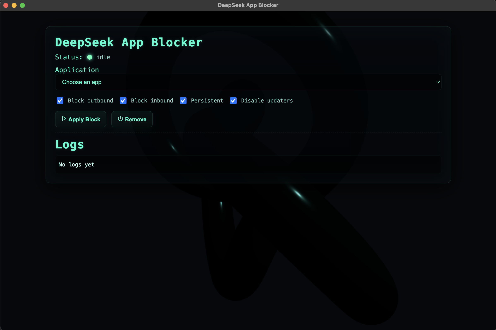

# electron-blocker-2025
⸻

DeepSeek Electron App Blocker

<!-- Core stack badges -->

<!-- Platform -->

⸻

Overview

DeepSeek Electron App Blocker is a macOS focused GUI tool that lets you block or isolate specific apps using PF (Packet Filter). The system provides:
    •    A modern Three.js animated background.
    •    A React based front end with a clean neon CRT visual style.
    •    A secure Electron preload bridge using IPC.
    •    A real time app dropdown populated from the host system.
    •    Apply or remove PF rules in one click.
    •    Logs and live status feedback.

The project is built with Electron + Vite + React for fast development and clean architecture.

⸻

Features
    •    App dropdown that auto-detects installed macOS applications.
    •    Toggle block inbound traffic.
    •    Toggle block outbound traffic.
    •    Enable persistent PF rules.
    •    Disable updaters.
    •    Live logs panel.
    •    3D background rendered with Three.js.
    •    Full isolation between renderer and main for security.
    •    Dev mode with Vite HMR.
    •    Production build loading dist files.

⸻

Project Structure

electron-blocker/
├── electron/
│   ├── main.js
│   └── preload.js
├── scripts/
│   └── block_app.sh
├── src/
│   ├── App.css
│   ├── App.jsx
│   └── main.jsx
├── index.html
├── package.json
├── run.sh
├── vite.config.js
└── README.md

⸻

Requirements
    •    macOS 12 or newer
    •    Node 18 or later
    •    Xcode Command Line Tools (for networking permissions)
    •    PF firewall enabled (default on macOS)

⸻

Install and Run

1. Clone the repo

git clone https://github.com/SimonTingle/electron-blocker.git
cd electron-blocker

2. Install dependencies

npm install

3. Run the app in dev mode

./run.sh

This boots Vite then launches Electron once the dev server is ready.

4. Build for production

npm run build
npm run electron

⸻

PF Blocking Logic

The tool applies PF rules to block traffic for a specific app bundle path.
The block_app.sh script receives the app name and applies persistent PF anchors.

You can audit the rules with:

sudo pfctl -s rules

Remove anchors with:

sudo pfctl -f /etc/pf.conf

⸻

Security Model
    •    Context isolation enabled.
    •    No node integration in renderer.
    •    All privileged operations run through preload IPC.
    •    No direct access to filesystem or shell from React layer.
    •    CSP warnings only show during dev mode.

⸻

Troubleshooting

White screen
Run:

npm run dev

Confirm Vite loads on browser:
http:localhost:5173

Missing apps in dropdown
Check main.js contains the IPC handler
Check preload.js exposes getApplications
Check window.electronAPI exists inside App.jsx

PF rules failing
Use:

sudo pfctl -nf /etc/pf.conf

to check syntax.

⸻

License

MIT License. Use freely.

⸻

